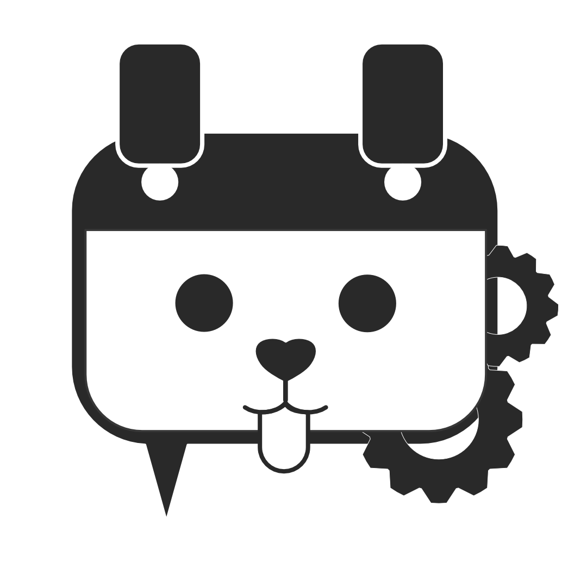

# Bark Dialogue Editor

<p align="center">
  
</p>

Relational JSON editor geared towards game dialogue editing built using [React](https://reactjs.org/), [ReactFlow](https://reactflow.dev/) and [Electron](https://www.electronjs.org/).

# Why?

I've used a handful of dialogue editors in the past and I've found that they tend to be either too rigid in their structured output or not structured much at all. I wanted to create a tool independent of any specific game engine where I could quickly define and save my own nodes to suit whatever project I'm working on.

Before I started this project, I had just gotten a job working with React. I was very new to it so I wanted to work on a side project to both help me improve my React skills and be a project that I would actually use. I found a cool node library called [ReactFlow](https://reactflow.dev/) and it all went from there. I know Electron has its fair share of haters and issues and I understand that it isn't exactly the best tool for native desktop development. If I find that I run into these same issues, I may try again with Haxe or DearImgui or something. That being said, I'd probably continue to have the React version available online for anyone who wants to use it!

# Scripts, Build & Run
### Development
```
yarn start:vite
```
To run the application in-browser

```
yarn build:electron
yarn electron:start
```
To build electron and run the app inside.

```
yarn start
```
Builds electron, starts vite (hopefully at localhost:3000) and spins up electron

```
yarn build
yarn delectron:package:<win/mac/linux> 
```

To create an executable for the target platform. As far as I'm aware, you need to be building on the corresponding platform for it to create the executable.

# Project Structure

```
├── dist (created once electron:package:<platform> is run)
    └──win-unpacked (ie: npm run electron:package:win)
├── docs
    └── specs.md
├── electron
    ├── main.ts
    ├── preload.ts
    └── tsconfig.json
├── index.html
├── package.json
├── package-lock.json
├── public
    ├── builtin.json
    ├── custom.json
    ├── favicon.ico
    ├── logo192.png
    ├── logo512.png
    ├── manifest.json
    ├── robots.txt
    └── theme.json
├── README.md
├── src
    ├── App.css
    ├── App.tsx
    ├── assets
    ├── components
    ├── contexts
    ├── helpers
    ├── index.css
    ├── index.tsx
    ├── page
    ├── reportWebVitals.ts
    ├── setupTests.ts
    ├── store
    └── tests
├── tsconfig.json
├── vite.config.ts
└── vite-env.d.ts
```
